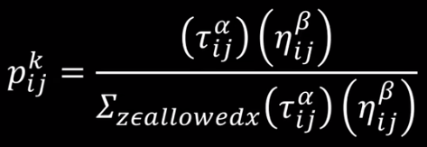
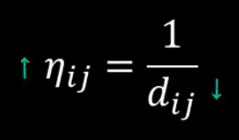
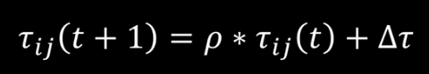
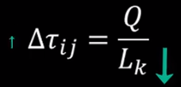
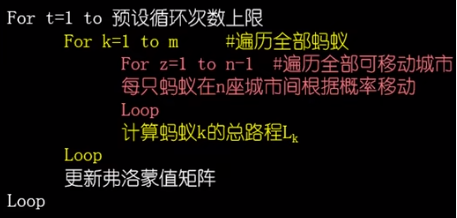

## ant_colony_optimization_algorithms
蚁群算法求解TSP(旅行商问题)

迭代公式,蚂蚁从i选取j城市的概率

其中arh和beta为自己定义的系数,
arh为0完全根据距离决定下一步,会陷入局部最优;

beta为0则完全根据信息素浓度决定,会快速收敛

其中t为信息素浓度,n为距离的倒数(能见度)

信息素浓度迭代公式

变化量的定义,其中Q为定义的全局量,L为总路程

局部信息就是城市距离,全局信息是信息素浓度

整体算法步骤

